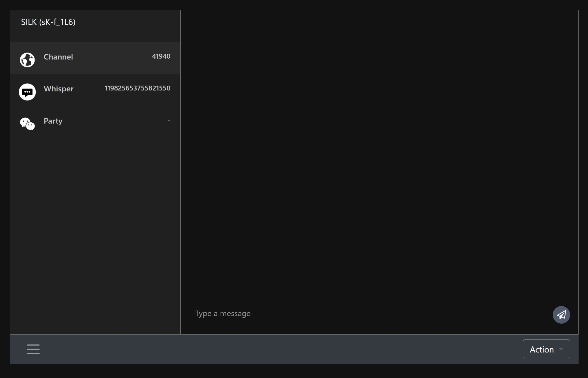

## Description
> nest.js chat server with socket.io

## Component
- [Nest](https://github.com/nestjs/nest) Framework 8
- [TypeScript](https://www.typescriptlang.org/) 4.x
- [Socket.IO](https://socket.io/docs/v4/) 4.x
- MySql 
- Redis

## Installation

```bash
$ npm install
```

## Running the app

```bash
# development
$ npm run start
# watch mode
$ npm run start:dev
# production mode
$ npm run start:prod
```

## Service app

```bash
# build
$ npm run build
# pm2
$ pm2 start dist/main.js
or
$ pm2 start config/ecosystem.js

```

## Chat Page


